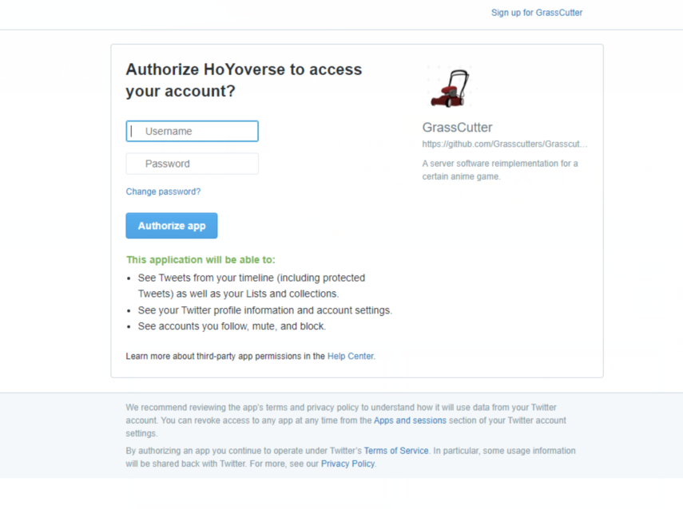
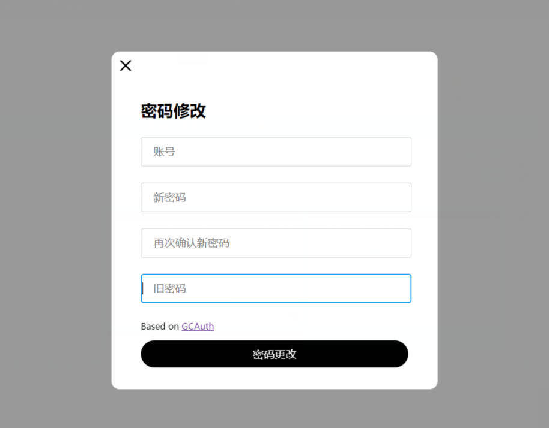
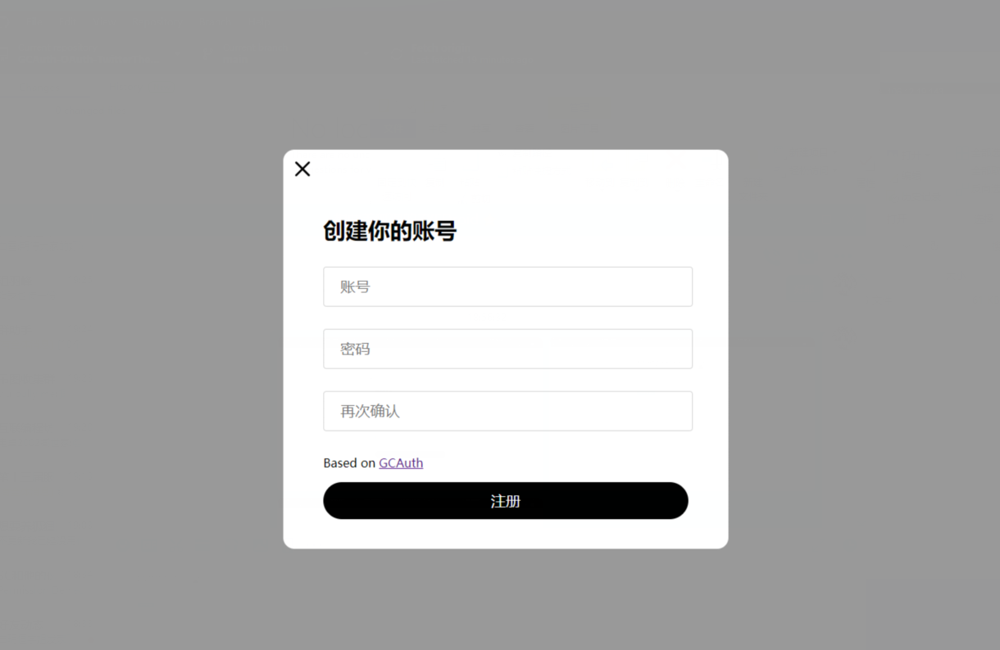

# GCAuth-OAuth-TwitterTheme
 Twitter 风格的 GCAuth-OAuth 页面

## 特性

 + 支持注册、登录、密码修改。

## 使用方法

  1. 按照 [https://github.com/Xtao-Team/GCAuth-OAuth](https://github.com/Xtao-Team/GCAuth-OAuth)项目的教程安装好相应插件
  2. 将 `plugins/GCAuth/OAuth` 路径内的文件替换为 realease 里的文件。
  3. Enjoy it！

## TODO List
  - [x] 注册
  - [x] 登录
  - [x] 更改密码

## preview

